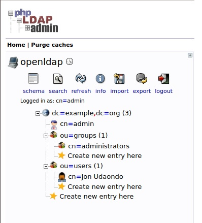
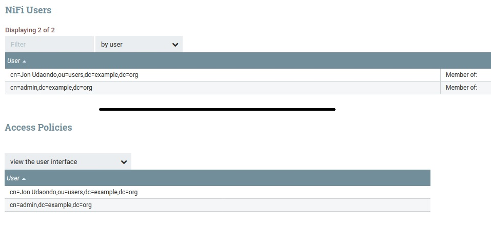

# Nifi LDAP Authentication Docker Setup

- [Nifi LDAP Authentication Docker Setup](#nifi-ldap-authentication-docker-setup)
  - [Login ldapadmin](#login-ldapadmin)
  - [Login NiFi](#login-nifi)
  - [Login in with custom user](#login-in-with-custom-user)
  - [Useful links](#useful-links)

## Login ldapadmin

To login into ldap UI please go to: `https://localhost:6443` and use following credentials.

```
User: cn=admin,dc=example,dc=org
Password: admin
```

## Login NiFi

To login into ldap UI please go to: `https://localhost:8443/nifi` and use following credentials.

```
User: admin
Password: admin
```

## Login in with custom user

To login with a custom user, we have to create the user on the `LDAP` UI.



Once it has been created, we have to go to NiFi UI and register the user on `NiFi Users` and give it `view the user interface` privileges on `Access Policies`.



## Useful links

- [Integration of NiFi with LDAP](https://pierrevillard.com/2017/01/24/integration-of-nifi-with-ldap/comment-page-1/)
- [Setup LDAP for Apache Nifi](https://vanducng.dev/2019/11/20/Setup-LDAP-for-Apache-Nifi/)
- [NiFi User Authentication with LDAP](https://community.cloudera.com/t5/Community-Articles/NiFi-User-Authentication-with-LDAP/ta-p/245035)
- [NiFi, Authentication and Authorization](https://ijokarumawak.github.io/nifi/2016/11/15/nifi-auth/)
- [How to deploy NiFi with user/password Authentication for all users](https://community.cloudera.com/t5/Support-Questions/How-to-deploy-NiFi-with-user-password-Authentication-for-all/td-p/215448)
- [Nifi LDAP Authentication Docker Setup](https://github.com/linksmart/nifi-ldap-authentication-setup)
- [Not able to view Nifi UI ](https://community.cloudera.com/t5/Support-Questions/Not-able-to-view-Nifi-UI/td-p/155011)
- [NiFi Authorization](https://docs.cloudera.com/HDPDocuments/HDF3/HDF-3.4.0/nifi-authorization/hdf-nifi-authorization.pdf)